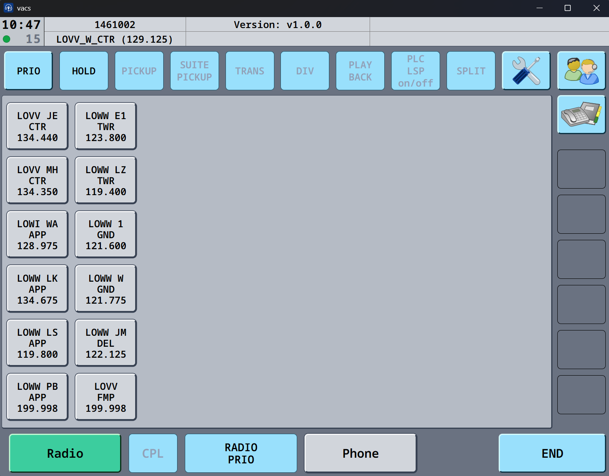
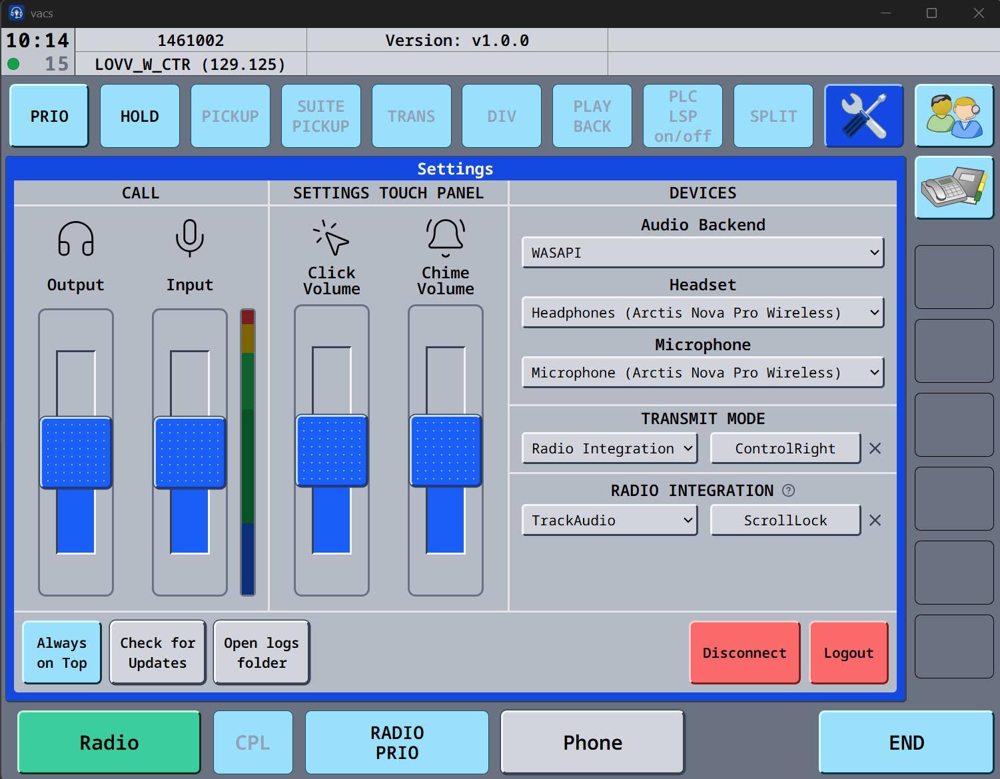
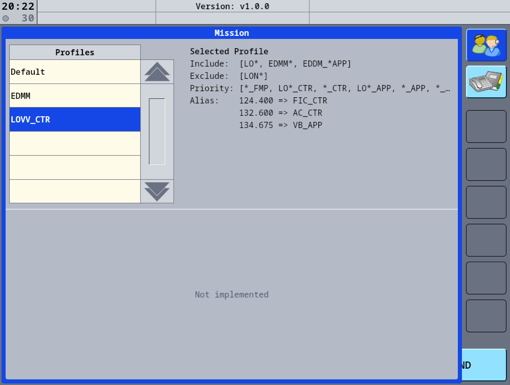
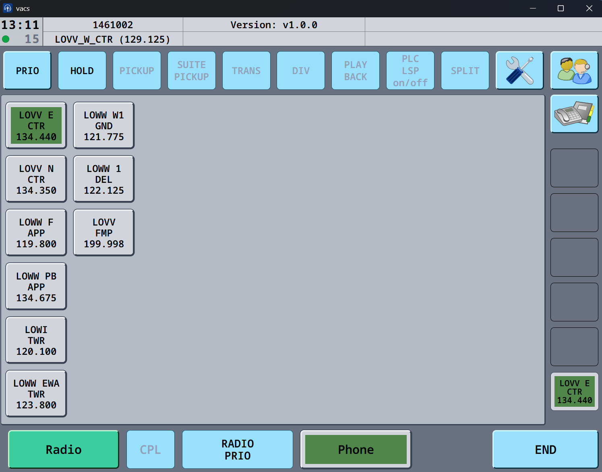
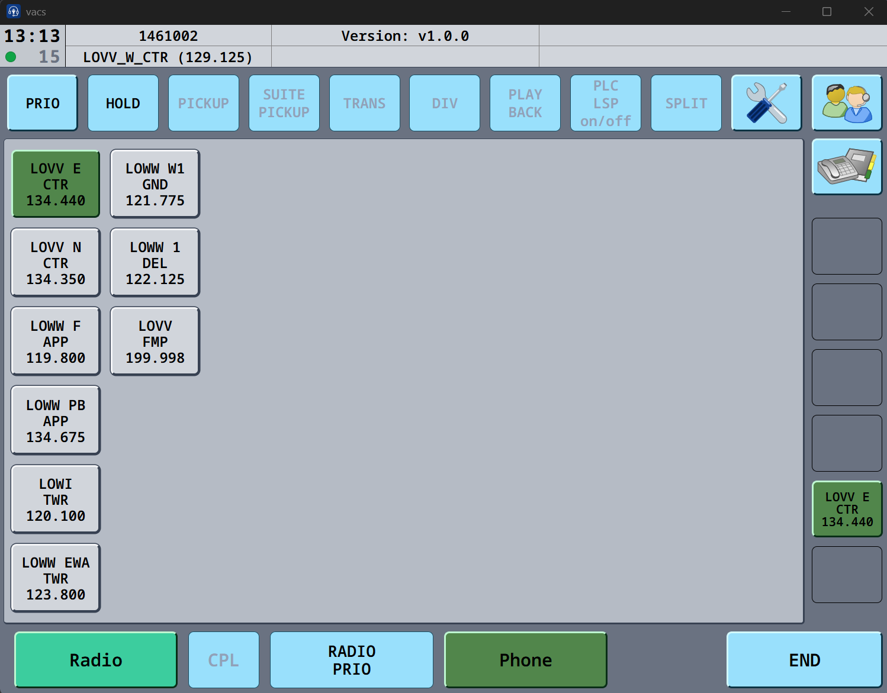
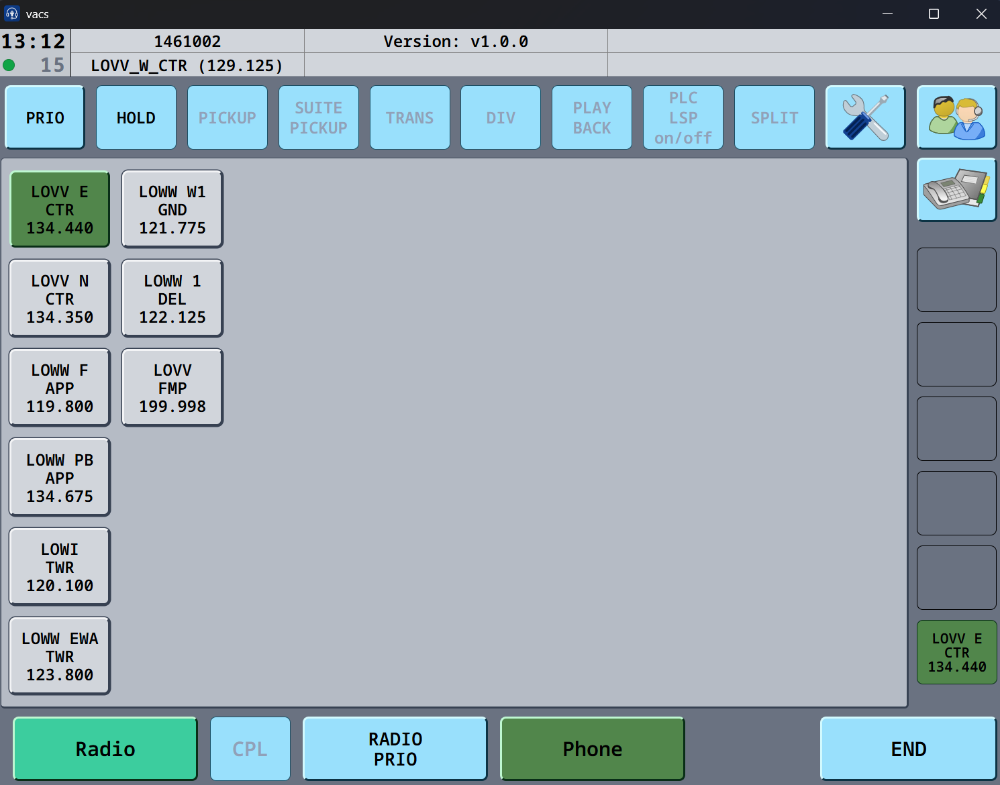

# vacs - VATSIM ATC Communication System

[](https://discord.gg/yu2nyCKU3R)

`vacs` is an open-source, cross-platform **Ground-To-Ground Voice Communication System for VATSIM**, meant to provide a seamless coordination experience for virtual air traffic controllers.

We aim to modernize VATSIM controller-to-controller coordination by providing a low-latency and easy-to-use voice communication system.

## Features

-   High-quality, low-latency voice communication using [Opus codec](https://opus-codec.org/)
-   Peer-to-peer audio streaming using [WebRTC](https://webrtc.org/) (no need for a centralized TeamSpeak/Discord or other voice server)
-   Simple authentication using [VATSIM Connect](https://vatsim.dev/services/connect/) (no need to provide your VATSIM credentials)
-   Cross-platform desktop client (Windows, Linux, macOS) using [Tauri](https://tauri.app/)
-   UI/UX inspired by real-life equivalents
-   (Partial) Integration with selected radio clients ([Audio For VATSIM](https://audio.vatsim.net/), [TrackAudio](https://github.com/pierr3/TrackAudio))

## Installation

As a controller, you merely need to download the latest version of the client for your platform from the [releases](https://github.com/MorpheusXAUT/vacs/releases/latest) page.

Releases are provided for:

-   Windows (`*.exe`)
-   Debian-based Linux distributions (`*.deb`)
-   Red Hat-based Linux distributions (`*.rpm`)
-   macOS Apple Silicon (`*aarch64.dmg`)
-   macOS Intel (`*x64.dmg`)

> [!NOTE]  
> Our macOS releases are currently not code signed and are thus automatically flagged as "corrupted". In order to run the application, you have to manually remove it from quarantine by running:
>
> ```bash
> sudo xattr -rd com.apple.quarantine /Applications/vacs.app
> ```

The client is self-contained and does not require any additional prerequisites or manual dependency installation.

All releases are signed - you can find instructions on how to verify these signatures in the [release verification docs](docs/release-verification.md).

## Updating

The `vacs` client has a built-in updater that will automatically notify you when a new version is available.

As we're making changes to our service, we may occasionally introduce breaking/non-backwards-compatible changes that require you to update your client before you can continue using `vacs`.

## System requirements

### Windows

-   Windows 10 or newer (64-bit)
-   No additional dependencies required (installer might automatically install webview dependency if no browser engine is available at all)

### Linux

-   Ubuntu 22.04+, Fedora 40+, or similar recommended
-   Required system dependencies are automatically selected by the package manager during client installation
-   ALSA audio backend required (automatically provided by Pipewire and PulseAudio plugins installed as dependencies)

> [!IMPORTANT]  
> If you're running a Wayland-based display server, please see our [Wayland support doc](vacs-client/docs/wayland.md) for details on limitations and supported features.  
> At the moment, no X11 support is available, although plans are to add it in the future.

### macOS

-   macOS High Sierra 10.13+ (Intel or Apple Silicon)
-   Microphone, input monitoring and accessibility control permissions must be granted on first launch

### Audio devices

-   `vacs` supports most input devices by resampling captured audio. For best results, use a device supporting 48 kHz sampling rate and either mono or stereo input channels. Note that audio is only transmitted as mono via WebRTC, so spatial input is lost.
-   Audio is resampled to the best available sample rate supported by the selected output device. For best results, use a stereo device with a sample rate of 48 kHz.
-   As we currently do not implement any echo cancellation, headset/headphone usage is recommended to avoid audio feedback while in a call.

## Screenshots


Main radio page displaying DA keys of stations to call


Settings page for audio and radio configuration


Mission page for stations profile selection


Outgoing call initiated by user before being picked up


Incoming call initiated by other user before being picked up (DA key blinks between green and grey state)


Established call between two parties (solid green DA key)

## Configuration

Most settings can be modified on the client's settings page (screwdriver and wrench icon in the top right corner).

Some (more advanced) settings require editing config files directly. See the [configuration docs](vacs-client/docs/config/README.md) for a detailed explanation.

## Support

If you encounter any issues or have questions about `vacs`, please use one of the following channels:

-   **Bug reports**: [open an issue](https://github.com/MorpheusXAUT/vacs/issues/new?template=bug_report.md) on our [issue tracker](https://github.com/MorpheusXAUT/vacs/issues) using the [`Bug report` template](https://github.com/MorpheusXAUT/vacs/issues/new?template=bug_report.md)
-   **Feature requests**: check out our [project status board](https://github.com/users/MorpheusXAUT/projects/2) and [open an issue](https://github.com/MorpheusXAUT/vacs/issues/new?template=feature_request.md) on our [issue tracker](https://github.com/MorpheusXAUT/vacs/issues) using the [`Feature request` template](https://github.com/MorpheusXAUT/vacs/issues/new?template=feature_request.md)
-   **Questions & discussions**: start a conversation on our [discussion forum](https://github.com/MorpheusXAUT/vacs/discussions)

Please search existing issues and discussions before creating a new one to avoid duplicates.

> [!TIP]  
> **Need help or just want to hang out?**  
> If you have questions, need support, or simply feel like chatting, check out our [Discord server](https://discord.gg/yu2nyCKU3R)!

### Known issues

-   **macOS claims `vacs` is broken and needs to be removed**: see macOS note in [Installation](#installation) section, you'll need to manually allow `vacs` to run since we're currently not using Apple code signing
-   **My Push-To-Talk/Push-To-Mute/Radio Integration key is not being picked up**: if you're running your radar and/or radio client as admin, you'll need to run `vacs` as admin as well, otherwise it won't be able to detect your key presses
-   **My calls fail to establish after a short time**: make sure your operating system and/or firewall are not blocking `vacs` from establishing network connections
-   **I'm transmitting on frequency right after accepting a call while using radio integration**: you'll need to wait for the call to be fully established (indicated by the little green indicator in the top left, below the current time) before pressing your PTT key to coordinate. While the call is still being established (usually takes between 50 and 200 milliseconds after picking up, indicated by a orange connection indicator), your PTT key still triggers your radio
-   **After toggling fullscreen on macOS, the client window is not rendered correctly**: this is a known quirk with our window library, which we effectively cannot work around. Slightly resize the window for all content to render properly again, the reset the size via the settings page. Alternatively, try toggling fullscreen a few times until it magically works.

## Roadmap

We track planned features, improvements, and known issues in our [GitHub Projects board](https://github.com/users/MorpheusXAUT/projects/2). Feel free to check there for what's coming next or to suggest new features.

## Signaling server

The `vacs` project provides a centralized signaling server (required for establishing calls), so no self-hosting is required. This server is used to track online stations and allow controllers to establish calls with their neighbors.  
As such, connecting to the default server is recommended to ensure the best possible reachability across the network.

However, we still provide the required server binaries in the form of a [Docker image](https://github.com/MorpheusXAUT/vacs/pkgs/container/vacs-server) should you prefer to host your own instance. Note that clients must manually edit their config files to specify your custom server URLs to use it and won't be able to call any other clients connected to the default server.

### Production environment

By default, all released `vacs` clients will connect to the production server located at `https://vacs.gusch.jetzt` (with the WebSocket endpoint available at `wss://vacs.gusch.jetzt/ws`). This server will always run the latest stable version available.

### Development environment

In addition to the production server, we also provide a development server running on `https://vacs-dev.gusch.jetzt` (`wss://vacs-dev.gusch.jetzt/ws`) that can be used to test new changes before deploying them to production. Furthermore, the dev server does not require live VATSIM credentials but uses the [VATSIM Connect Sandbox environment](https://vatsim.dev/services/connect/sandbox) and its associated credentials. No active VATSIM connection is required to connect to the dev server.

## Privacy & data handling

**tl;dr** No audio is recorded, no credentials are stored, and calls are peer-to-peer. Your IP is visible to call participants.

-   Neither `vacs-client` nor `vacs-server` access your personal details (name, rating, etc.), we only process and temporarily store your VATSIM CID
-   `vacs-client` does not record or store any audio data received or sent
-   `vacs-server` does not receive any audio data **at all** as all calls are peer-to-peer
-   Due to the peer-to-peer nature of `vacs-client`, your IP address is exposed to the other party once a call has been accepted and is established
-   To establish peer-to-peer calls across different networks, `vacs-client` uses a [STUN](https://en.wikipedia.org/wiki/STUN) server to discover your public WebRTC endpoints. By default, the [Cloudflare STUN servers](https://developers.cloudflare.com/realtime/turn/#service-address-and-ports) are used. No audio or personal data is ever sent to the STUN server — it only exchanges minimal network metadata required for NAT traversal, however your IP address is visible to the service.
-   If you configure a [TURN](https://en.wikipedia.org/wiki/TURN) server, `vacs-client` may relay WebRTC media through it when direct peer-to-peer connections are not possible. Your IP address as well as the (unencrypted) voice data is visible to the service.
-   In addition, we use Cloudflare's [TURN Service](https://developers.cloudflare.com/realtime/turn/) to provide our users with a fast and reliable relay service in case direct peer-to-peer connections fail because of restrictive networks. Note that `vacs-client` **does not** use these relay servers unless all other connection attempts have failed. You can read more about Cloudflare's access to WebRTC data in their [service FAQs](https://developers.cloudflare.com/realtime/turn/faq/#what-data-can-cloudflare-access-when-turn-is-used-with-webrtc).
-   `vacs-client` does not need or access your VATSIM credentials. The VATSIM Connect API only requires a valid VATSIM account to be logged in, however your password is never sent to `vacs-client` or `vacs-server`
-   The OAuth2 token received from VATSIM Connect is not persisted locally
-   `vacs-server` creates an opaque session for each login and only associated your VATSIM CID. No other user data is stored
-   The local session storage in `vacs-client` is encrypted using OS-specific encryption mechanisms and inaccessible to other applications
-   No long-term logs or call metadata are retained
-   The call log displayed in `vacs-client` is client-side only and deleted once the client is disconnected

## Architecture

The `vacs` project is a [Rust](https://rust-lang.org/) monorepo containing several crates:

-   `vacs-client`: Cross-platform desktop client using [Tauri](https://tauri.app/) and [Preact](https://preactjs.com/)
-   `vacs-server`: Axum-based signaling server providing HTTP and websocket API
-   `vacs-protocol`: Shared protocol and types between client and server
-   `vacs-audio`: CPAL audio backend including Opus encoder/decoder, a waveform generator and a basic mixer and DSP
-   `vacs-webrtc`: WebRTC peer connection abstraction including protocol handling
-   `vacs-signaling`: Websocket signaling protocol implementation and abstractions
-   `vacs-vatsim`: Various VATSIM-specific client implementations and utilities used by both client and server
-   `vacs-macros`: Internal macros used by various crates

While these crates were primarily developed to be used in our project's own client, they are also usable independently and aim to provide some abstractions to reduce developer load when implementing a custom client.

## License

The `vacs` project and all its crates and packages are dual-licensed as

-   **MIT License** ([LICENSE-MIT](LICENSE-MIT))
-   **Apache License, Version 2.0** ([LICENSE-APACHE](LICENSE-APACHE))

at your option.

This means you can choose to use `vacs` under either the MIT license or the
Apache-2.0 license.

Unless you explicitly state otherwise, any contribution intentionally submitted
for inclusion in this project is provided under the same dual-license terms.
